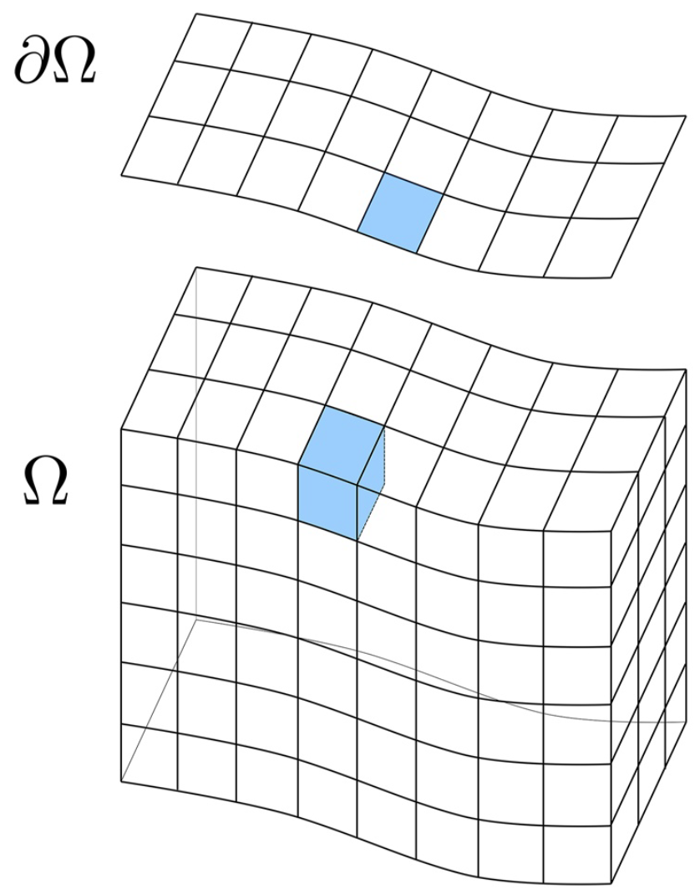

# Goals

<br>

- Understand the basics of the .content-box-purple[`transport PK`]
- Build simple to advanced transport models with .content-box-yellow[`Amanzi-ATS`]
- .content-box-red[Visualize and analyze] `Amanzi-ATS` model outputs

---

# Website

<br>

**Github `r fontawesome::fa("github")`:**

[`https://github.com/amanzi/ats-hands-on-transport`](https://github.com/amanzi/ats-hands-on-transport)

<br>

**Slides for tutorial:**

[`https://amanzi.github.io/ats-hands-on-transport/slides.html`](https://amanzi.github.io/ats-hands-on-transport/slides.html)

<br>

.font70[
**Other `Amanzi-ATS` resources:**
- Documentation: [`https://amanzi.github.io/ats/stable/`](https://amanzi.github.io/ats/stable/)
- Short course: [`https://github.com/amanzi/ats-short-course`](https://github.com/amanzi/ats-short-course)
- Regression tests: [`https://github.com/amanzi/ats-regression-tests`](https://github.com/amanzi/ats-regression-tests)
- Demos: [`https://github.com/amanzi/ats-demos`](https://github.com/amanzi/ats-demos)
]

---

# Setting up environment 

<br>

- Pull the `docker` `r fontawesome::fa("docker")` image

```{bash, eval=FALSE}
docker pull --platform linux/amd64 metsi/ideas-watersheds-all-hands-2024:latest
```

<br>

- Run the `docker` container to start the `JupyterLab` server

```{bash, eval=FALSE}
docker run -p 8888:8888 metsi/ideas-watersheds-all-hands-2024:latest
```

---
# VSCode and Dev Containers

<br>

### If you prefer VSCode/Cursor editors, use the extensions:
- .content-box-green[`Dev Containers`] to connect to the container and edit files (e.g., `XML`). 
  - .font90[Convenient for data transfer between `host` and `container`]
  
  <br>

- .content-box-purple[`jupyter`] to edit/run notebooks inside the container with VSCode.

---
# Clone the repository

<br />

- In the `JupyterLab` server, open a terminal and run: `r fontawesome::fa("github")`

```{bash, eval=FALSE}
git clone https://github.com/amanzi/ats-hands-on-transport.git
```
---

# Outlines

<br>

#### .blockquote[Integrated hydrology:]
- Understand and run the model (2-D & 3-D)
- Visualize and interpret the outputs

#### .blockquote[Transport Modeling:]
- **Catchment scale:** 2-D & 3-D transport across the entire domain
- **River network scale:** 1-D transport within the river corridor
  - .content-box-green[Develop and couple] transport models with integrated hydrology
  - Visualize and interpret results


---
class: phong-dark
# .brand-orange[Integrated hydrology model]

---
# Integrated hydrology model

**Water mass conservation equations:**

.pull-left-21[
- Surface
$$ \frac{\partial \Theta_s}{\partial t} + \nabla \cdot \vec{\mathbf{q}_s} = Q_s + Q_e$$

- Subsurface
$$ \frac{\partial \Theta_g}{\partial t} + \nabla \cdot \vec{\mathbf{q}_g} = Q_g$$

.font80[**where:**]
]
.pull-right-12[

]

.content-box-yellow[
.pull-left[.font70[
- $\Theta_s = \eta \times h$: .brand-blue[mass of water per unit surface area (mol/m^2)]
- $q_s$: .brand-blue[surface water flux (mol/m/s)]
- $\eta$: .brand-blue[molar density of liquid water (mol/m^3)]
- $h$: .brand-blue[ponded depth (m)]
]]

.pull-right[.font70[
- $\Theta_g = \eta \times S_w \times \phi$: .brand-blue[subsurface water content (mol/m^3)]
- $q_g$: .brand-blue[flux of water in the subsurface (mol/m^2/s)]
- $S_w$: .brand-blue[water saturation (m^3/m^3)]
- $\phi$: .brand-blue[medium porosity (m^3/m^3)]
]]
]

.footnote[```Molins et al. (2022)```]

---
# Steps to Construct a Model
.pull-left-64[
.font90[
- **.brand-blue[Simulation domains]** `r fontawesome::fa("map")`
  - Where the processes happen

- .content-box-green[**.brand-blue[Dependency graph]** `r fontawesome::fa("sitemap")`]
  - Which `PKs` to use and how they are coupled


- **.brand-blue[Model parameters]** `r fontawesome::fa("sliders")`
  - Physical and numerical properties

- **.brand-blue[Initial and boundary conditions]** `r fontawesome::fa("cogs")` `r fontawesome::fa("clock")`
  - State of the system at $t=t_0$
  - How system behaves at the boundaries at $t \ge t_0$

- **.brand-blue[Forcing, sources and sinks]** `r fontawesome::fa("cloud-sun-rain")`
  - External forces that drive changes in the system
  - Material or energy added/removed to/from the system
]]

--

<br>

.pull-right-46[

**ATS `xml` top level list:**
```r
Main
- mesh: ["mesh-typed-spec-list"]
- regions: ["region-typedinline-spec-list"]
- cycle driver: ["coordinator-spec"]
- PKs: ["pk-typedinline-spec-list"]
- state: ["state-spec"]
*- visualization: ["visualization-spec-list"]
*- checkpoint: ["checkpoint-spec"]
*- observations: ["observation-spec-list"]
```
]

.footnote[[ATS Documentation](https://amanzi.github.io/ats/stable/input_spec/main.html)]

---

# Domain of simulation
.pull-left-31[
<iframe width="800" height="550" src="imgs/domain.html", frameborder="0"></iframe>
]

.pull-right-13[
<br> <br>
.font60[
.content-box-purple[
.center[.brand-blue[**Entire Catchment**]]

**Dimensions:** 400 x 500 m

**\# of surface cells:** 1521

**\# of river corridor cells:** 62

**\# of soil layers:** 7

**\# of subsurface cells:** 10647

$\Delta$z = [0.1, 0.1, 0.1, 0.2, 0.2, 0.4, 0.4]

** Soil thickness:** 1.5 (m)
]]

.font60[
.content-box-yellow[
.center[.brand-red[`r fontawesome::fa("square")` **Square City**]]

**Dimensions:** 50 x 50 m

**\# of surface cells:** 92
]]
]

.font60[.footnote[<a href="imgs/domain.html" target="_blank">```domain of simulation```</a>]]

---

# Dependency Graph - Integrated Hydrology

.pull-left-64[
<iframe src="imgs/dependency_hydro.html" width="600" height="500" frameborder="0"></iframe>
]

.font70[
- **PK:** [`Process kernels`](https://amanzi.github.io/ats/stable/input_spec/process_kernels/index.html)
- **MPC:** [`Multi-process-couplers`](https://amanzi.github.io/ats/stable/input_spec/process_kernels/mpcs/index.html)
]

--

.pull-right-46[
.font70[
```xml
<ParameterList name="Main">
  <ParameterList name="cycle driver">
    <ParameterList name="PK tree">
      <ParameterList name="flow coupler">
        <Parameter name="PK type" type="string" value="coupled water" />
        <ParameterList name="flow">
          <Parameter name="PK type" type="string" value="richards flow" />
        </ParameterList>
        <ParameterList name="overland flow">
          <Parameter name="PK type" type="string" value="overland flow, pressure basis" />
        </ParameterList>
      </ParameterList>
    </ParameterList>
  </ParameterList>

* OTHER LISTS...

  <ParameterList name="PKs">
    <ParameterList name="flow coupler">
      <Parameter name="PK type" type="string" value="coupled water" />
      <Parameter name="PKs order" type="Array(string)" value="{flow, overland flow}" />
    </ParameterList>
*   OTHER PKS (i.e., flow, overland flow)
  </ParameterList>
</ParameterList>  
```
]]

---

# Hydrology Model Parameters
.small[
.pull-left-64[
- Surface
$$ \frac{\partial \eta h}{\partial t} + \nabla \cdot \mathbf{q}_s = Q_s + Q_e$$
- Subsurface
$$ \frac{\partial \eta S_w \phi}{\partial t} + \nabla \cdot \mathbf{q}_g = Q_g$$
]]

--
.footnotesize[.pull-right-46[
<br>
$$\mathbf{q}_s = -\eta h \frac{h^{4/3}} {n_{mann} \sqrt{|\nabla z|} } \nabla (\eta + z)$$

<br>

$$\mathbf{q}_g = -\frac{\eta}{\mu} k_r K (\nabla p +  \rho g\mathbf{z})$$

.content-box-green[
- $n_{mann}$: Manning's coefficient
- $\mu$: liquid viscosity
- $k_r$: relative permeability
- $K$: absolute permeability
- ...
]]
]

--

.pull-left[
.font50[
```xml
<ParameterList name="state">
  <ParameterList name="evaluators">
*   OTHER EVALUATORS ...
    <ParameterList name="viscosity_liquid">
      <Parameter name="evaluator type" type="string" value="independent variable constant" />
      <Parameter name="value" type="double" value="0.00059" />
    </ParameterList>
    <ParameterList name="surface-manning_coefficient">
      <Parameter name="evaluator type" type="string" value="independent variable constant" />
      <Parameter name="value" type="double" value="0.15" />
    </ParameterList>
    <ParameterList name="permeability">
      <Parameter name="evaluator type" type="string" value="independent variable constant" />
      <Parameter name="value" type="double" value="5e-13" />
    </ParameterList>
    <ParameterList name="relative_permeability">
      <Parameter name="evaluator type" type="string" value="relative permeability, water retention model" />
      <Parameter name="model parameters" type="string" value="WRM parameters" />
    </ParameterList>        
*   OTHER EVALUATORS ...    
  </ParameterList>
</ParameterList>  
```
]]

---
# Forcings & sources/sinks
<br />
.pull-left[
```{r, fig.height=6, fig.width=12, fig.retina=2, fig.align='center', message=FALSE, warning=FALSE, echo=FALSE}
library(ggplot2)
# Define the time sequence and rainfall rates as a data frame
time <- seq(0, 24, by = 0.02)
rainfall_rate <- ifelse(time <= 16, 18, 0)
data <- data.frame(time = time, rainfall_rate = rainfall_rate)

ggplot(data, aes(x = time, y = rainfall_rate)) +
  geom_line(color = "blue", size = 2) +
  labs(title = "Forcing Inputs", x = "Time (hours)", y = "Rainfall Rate (mm/hr)") +
  ylim(0, 20) +
  xlim(0, 24) +
  scale_x_continuous(breaks = seq(0, 24, by = 6)) +
  theme_minimal() +
  theme(
      plot.title = element_text(size = 32, face = "bold", hjust = 0.5),
      axis.title.x = element_text(size = 24),
      axis.title.y = element_text(size = 24),
      axis.text.x = element_text(size = 20),
      axis.text.y = element_text(size = 20)  
  )
```

.content-box-purple[.small[`No source/sink in this example`]]
]

.pull-right[
.font80[
```xml
<ParameterList name="state">
  <ParameterList name="evaluators">
    <ParameterList name="surface-water_source">
      <Parameter name="evaluator type" type="string" value="independent variable" />
      <ParameterList name="function">
        <ParameterList name="domain rain">
          <Parameter name="region" type="string" value="surface domain" />
          <Parameter name="component" type="string" value="cell" />
*         <ParameterList name="function">
*           <ParameterList name="function-tabular">
*             <Parameter name="x values" type="Array(double)" value="{0, 57600}" />
*             <Parameter name="y values" type="Array(double)" value="{5e-06, 0}" />
*             <Parameter name="forms" type="Array(string)" value="{constant}" />
*           </ParameterList>
*         </ParameterList>
        </ParameterList>
      </ParameterList>
    </ParameterList>
</ParameterList>  
```
]]

---

# Initial and boundary conditions
.pull-left[
#### .blockquote[Initial conditions .gray[(true)]]
.small[
- located inside each PK in the `xml` file
- can be:
  - created from functions
  - loaded from files (e.g. checkpoints)
]

#### .blockquote[Boundary conditions]
.small[
- located inside each PK in the `xml` file
- if not specified, no-flow BCs are applied
]]

.pull-right[
.font80[
```xml
<ParameterList name="flow">
* <ParameterList name="initial condition">
    <Parameter name="hydrostatic head [m]" type="double" value="-1.1" />
    <Parameter name="hydrostatic water density [kg m^-3]" type="double" value="1000" />
  </ParameterList>
* <ParameterList name="boundary conditions">
  </ParameterList>  
</ParameterList>

...

<ParameterList name="overland flow">
* <ParameterList name="initial condition">
    <Parameter name="initialize surface head from subsurface" type="bool" value="true" />
  </ParameterList>
* <ParameterList name="boundary conditions">
    <ParameterList name="zero gradient">
      <ParameterList name="outlet">
        <Parameter name="regions" type="Array(string)" value="{surface outlet face}" />
      </ParameterList>
    </ParameterList>
  </ParameterList>
</ParameterList>
```
]]


.footnote[`See the documentation for details about ICs and BCs:` [`https://amanzi.github.io/ats/stable/input_spec/common.html`](https://amanzi.github.io/ats/stable/input_spec/common.html)]


---

class: phong-dark
# .brand-orange[Transport hands-on]

---

# Transport
<br>

.pull-left[
**Advection-Dispersion Equation (ADE):**
$$
    \frac{\partial (\Theta C)}{\partial t} + \nabla \cdot(\mathbf{u} C) - \nabla \cdot (D \Theta \nabla C) + S = 0
$$
]

.pull-right[
.font80[
.content-box-purple[
- $C$: .brand-blue[the concentration of the solute (molC/molH2O)],
- $S$: .brand-blue[any source term],
- $D$: .brand-blue[diffusion coefficient (m^2/s)],
- $\mathbf{u}$: .brand-blue[the flow velocity field (m/s)].
]]]

--
<br>
<br>
.green[
**For transport in a subsurface domain** ($\Omega \in \mathbb{R}^3$): &nbsp; $\Theta = \eta \phi S_w$, &nbsp; $\mathbf{u}=q_g$, &nbsp; $D=D_g$.
]

--
<br>
.orange[
**For transport in a surface domain** ($\Omega \in \mathbb{R}^n$; $n=1,2$): &nbsp; $\Theta = \eta h$, &nbsp; $\mathbf{u}=q_s$, &nbsp; $D=D_s$. 
]

---

# Dependency Graph - Transport
Let's construct the **dependency graph** (or `PK tree`) for the integrated transport model.

<iframe src="imgs/dependency.html" width="1200" height="600" frameborder="0"></iframe>


.footnote[
  <a href="imgs/dependency_transport.html" target="_blank">```graph: transport```</a> &nbsp; &nbsp; &nbsp; &nbsp;
  <a href="imgs/dependency_transport_reactive.html" target="_blank">```graph: reactive transport```</a> &nbsp; &nbsp; &nbsp; &nbsp;
  <a href="imgs/dependency_transport_reactive_ecohydrology.html" target="_blank">```graph: reactive transport & ecohydrology```</a>
]
---

# Transport Model Parameters
**Advection-Dispersion Equation (ADE):**
$$ \frac{\partial (\Theta C)}{\partial t} + \nabla \cdot(\mathbf{u} C) - \nabla \cdot (D \Theta \nabla C) + S = 0 $$

--

.pull-left[
.small[
- $C$: .brand-red[unknown concentration] `r fontawesome::fa("angle-right")` `we want it`
- $S$: .brand-red[source term] `r fontawesome::fa("angle-right")` `we specify it`
- $D$: .brand-red[dispersion coefficient] `r fontawesome::fa("angle-right")` `we specify it`
- $\mathbf{u}, \Theta$: `r fontawesome::fa("long-arrow-left")` .content-box-green[`from the hydrology model`]
  - $\Theta_g = \eta \times \phi \times S_w$, &nbsp; $\mathbf{u}=q_g$
  - $\Theta_s = \eta \times h$, &nbsp; $\mathbf{u}=q_s$
]]

--

.pull-right[
.footnotesize[
```xml
<ParameterList name="TRANPORT_PK">
* <ParameterList name="source terms">
    <ParameterList name="component mass source">
      <ParameterList name="SOURCE_NAME">
        <Parameter name="component names" type="Array(string)" value="{TRACER_NAME}"/>
        <Parameter name="regions" type="Array(string)" value="{REGION}"/>
        <Parameter name="spatial distribution method" type="string" value="METHOD"/>
        <ParameterList name="source function">
                  <<<<< FUNCTION DEFINITION >>>>>
        </ParameterList>
      </ParameterList>
    </ParameterList>
  </ParameterList>

  <ParameterList name="material properties">
    <ParameterList name="domain">
      <Parameter name="regions" type="Array(string)" value="{REGION_DOMAIN}" />
                  <<<<< OTHERS PARAMETERS >>>>>
      <ParameterList name="parameters for scalar">
*       <Parameter name="dispersion coefficient [m^2 s^-1]" type="double" value="####" />
      </ParameterList>
    </ParameterList>
  </ParameterList>
</ParameterList>  
```
]]

---

# Initial and boundary conditions

<br />

**Initial conditions**
- We set concentration to zero everywhere at the beginning
      
```xml      
<ParameterList name="TRANPORT_PK">
  <ParameterList name="initial condition" type="ParameterList">
    <Parameter name="constant" type="double" value="0" />
  </ParameterList>
</ParameterList>
```

**Boundary conditions**
- We use no-flux BCs at the boundaries `r fontawesome::fa("long-arrow-right")` `do not need to specify`

---
# Sources and sinks

- We inject tracer at a constant rate at the city for a short period of time

.small[
```xml
<ParameterList name="TRANPORT_PK">
* <ParameterList name="source terms">
    <ParameterList name="component mass source">
      <ParameterList name="Tracer injection">
        <Parameter name="component names" type="Array(string)" value="{Tracer1}" />
        <Parameter name="regions" type="Array(string)" value="{tracer_injection}" />
        <Parameter name="spatial distribution method" type="string" value="volume" />
        <ParameterList name="source function">
          <ParameterList name="function-tabular" type="ParameterList">
            <Parameter name="x values" type="Array(double)" value="{ 0,14400,18000}" />
            <Parameter name="y values" type="Array(double)" value="{ 0, 1000, 0}" />
            <Parameter name="forms" type="Array(string)" value="{constant, constant}" />
          </ParameterList>
        </ParameterList>
      </ParameterList>
    </ParameterList>
  </ParameterList>
</ParameterList>  
```

.content-box-purple[`volume`]: source is considered as extensive quantity (molC/s) and is evenly distributed across the region.

]
